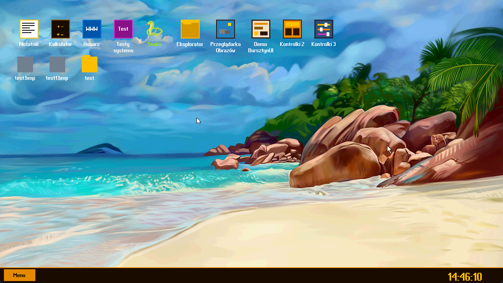

# Bursztyn OS 

## Czym jest Bursztyn OS?
Tworzę niezależny, polski system operacyjny Bursztyn OS jest on 64 bitowy dla architektury x86. System powstaje od podstaw i nie wykorzystuje Linuksa ani Windowsa jako swojej bazy.
Jądro, zarządzanie pamięcią, system procesów, sterowniki, środowisko graficzne, natywny stos sieciowy TCP/IP, autorski system plików na dyskach AHCI SATA, niezależny logiczny model bezpieczeństwa (PZB) oraz w pełni graficzne środowisko uruchomieniowe (GUI) dla programów w Ring 3. i aplikacje są rozwijane specjalnie dla Bursztyn OS. W wybranych obszarach korzystam również z jasno wskazanych zewnętrznych bibliotek dostosowanych do środowiska bare-metal, takich jak mbedTLS odpowiadający za kryptografię i połączenia TLS.
### Projekt rozpocząłem 13 czerwca 2026r. I rozwijam go samodzielnie.

Repozytorium na GitHub jest prywatne

---

## 🖥️ Środowisko Graficzne i Aplikacje (Ring 3)

Bursztyn OS to pełnoprawny system okienkowy. Posiada autorską warstwę HAL (obsługa UEFI GOP oraz VESA VBE) i proporcjonalne czcionki UTF-8. 

**Pulpit Bursztyn OS**
System uruchamia interaktywny pulpit z paskiem zadań, rozwijanym menu i wsparciem dla myszy PS/2 (Z-Order, Drag & Drop).

**Aplikacje użytkowe (Paczki .cebula)**
Programy w Bursztyn OS są odizolowane i posiadają własne manifesty uprawnień. Aplikacje możesz uruchamiać klikając w ikony na pulpicie lub wywołując je z terminala (np. `uruchom /programy/notatnik.cebula/notatnik.bur`).

## Co już działa?
Bursztyn OS posiada obecnie między innymi:
* własne 64-bitowe jądro i zarządzanie pamięcią,
* aplikacje działające w odizolowanej przestrzeni Ring 3,
* wielozadaniowość i obsługę wielu procesów,
* własny pulpit, menedżer okien, pasek zadań i Menu Start,
* składacz obrazu wykorzystujący osobne warstwy aplikacji,
* framework graficzny BursztynUI z polskojęzycznym API,
* własny system plików PSF/BSP2 z trwałym zapisem na dysku,
* obsługę dysków SATA przez AHCI,
* natywny stos USB xHCI oraz obsługę klawiatury i myszy USB,
* własny stos sieciowy z DHCP, DNS, TCP/IP, HTTP i HTTPS,
* model uprawnień aplikacji PZB,
* obsługę dźwięku Intel HDA,
* uruchamianie systemu w trybie BIOS i UEFI.
* własny autorksi format tapet .btp możliwość zmiany tapet w systemie, automatyczne ładowanie nowych tapet. 
* Konwerter plików jpg, png na btp
* zmiana rozdzielczośći ekranu

## Dostępne aplikacje
* **Notatnik:** Edytor tekstowy obsługujący odczyt i zapis z dysku AHCI.
* **Kalkulator:**
* **Przeglądarka zdjęć:**
* **Przeglądarka internetowa Husarz:**
* **Testy systemu** program dla testów systemu
* **Eksplorator plików**
* **Powłoka Bursztyna**
* **Ustawienia ekranu**
* **Tapety**
* **gra Snake,**

---

## ⌨️ Powłoka Bursztynowa (Terminal)

Powłoka systemowa to, zintegrowane narzędzie działające w oknie. Oferuje pełną obsługę polskich znaków oraz natywnego klienta sieci.

**Dostępne polecenia:**

**⚙️ Systemowe:**
* `pomoc` - wyświetla dostępną listę komend.
* `system` - wypisuje informacje o architekturze Bursztyn OS.
* `wersja` - krótka informacja o wersji powłoki i OS.
* `kto` - odpowiada, na jakich prawach PZB aktualnie działasz.
* `pci` - wyświetla urządzenia na płycie głównej (magistrala PCI).
* `czas` - wyświetla aktualną godzinę ze sprzętowego zegara RTC.
* `historia` - pokazuje 5 ostatnich wpisanych przez Ciebie poleceń.
* `czysc` - czyści ekran terminala.
* `wyjdz` - zamyka powłokę bursztynową i wraca na pulpit.

**🌐 Sieć i Internet (TCP/IP):**
* `ping [adres/domena]` - wysyła sygnał ICMP (np. `ping 10.0.2.2` lub `ping google.com`).
* `pobierz [domena] [sciezka] [zapisz_jako]` - pobiera plik z sieci przez HTTP (np. `pobierz example.com / /test.html`).

**📁 Zarządzanie Plikami (Dysk AHCI):**
* `uruchom [plik]` - uruchamia aplikację (np. `uruchom /programy/kalkulator.cebula/kalkulator.bur`).
* `utworz` - kreator tworzenia nowego, pustego pliku/katalogu na dysku.
* `zapisz` - zapisuje tekst do pliku.
* `czytaj [plik]` - wyświetla zawartość wskazanego pliku.
* `pliki [katalog]` - wylistowuje zawartość katalogu.
* `usun [sciezka]` - trwale usuwa plik lub katalog z dysku.
* `zmien_nazwe` - kreator zmiany nazwy pliku/katalogu.
* `gdzie` - wyświetla ścieżkę obecnego katalogu.

**🎲 Rozrywka:**
* `pisz [tekst]` - wypisuje podany tekst na ekran (echo).
* `cytat` - wczytuje i wyświetla cytaty z pliku.
* `losuj` - rzuca wirtualną kością (wynik 1-6).

**Testowanie
*`dzwiek` - generuje ton dla testu dźwięku w systemie

---

## 🗂️ Struktura Dokumentacji Technicznej

Poniższe pliki zawierają pełną specyfikację techniczną, opisy mechanizmów oraz analizę kodu źródłowego systemu:

1. [01_wstep_i_filozofia.md](docs/01_wstep_i_filozofia.md) – Wizja projektu, założenia ideologiczne, polskie nazewnictwo i roadmapa.
2. [02_architektura_systemu.md](docs/02_architektura_systemu.md) – Podział Ring 0/Ring 3, sprzętowy TSS oraz logiczny model bezpieczeństwa PZB (Poziom Zaufania Bursztyna).
3. [03_proces_rozruchu.md](docs/03_proces_rozruchu.md) – Analiza wymuszeń graficznych Multiboot2, tymczasowe stronicowanie i skok do Long Mode.
4. [04_zarzadzanie_sprzetem.md](docs/04_zarzadzanie_sprzetem.md) – Inicjalizacja GDT, IDT (z systemem BSOD), APIC, Zegar Systemowy, RTC oraz mysz PS/2.
5. [05_bursztynowy_system_plikow.md](docs/05_bursztynowy_system_plikow.md) – Specyfikacja systemu BSP trwale zapisywanego na sterowniku AHCI SATA.
6. [06_wywolania_systemowe.md](docs/06_wywolania_systemowe.md) – Architektura 26 funkcji BWS (Bursztynowych Wywołań Systemowych) izolujących Ring 3.
7. [07_ekosystem_i_formaty.md](docs/07_ekosystem_i_formaty.md) – Specyfikacja binarna `.bur`, struktura paczek `.cebula` oraz manifesty `opis.aplikacji`.
8. [08_bursztynowy_slownik_i_architektura.md](docs/08_bursztynowy_slownik_i_architektura.md) – Oficjalny słownik pojęć (Teczka, Włókno, Planista) oraz rendering UTF-8.
9. [09_tryb_graficzny.md](docs/09_tryb_graficzny.md) - Zorientowana obiektowo warstwa HAL (UEFI GOP, VESA), Double Buffering i Z-Order.
10. [10_siec.md](docs/10_siec.md) - Stos sieciowy: E1000, ICMP, DHCP, klient DNS (UDP) oraz pobieranie plików (TCP/HTTP).

---

## 🛠️ Architektura w pigułce

* **Procesor:** x86-64 Long Mode (Start przez standard Multiboot2 z GRUB).
* **Izolacja / Bezpieczeństwo:** Sprzętowe Ring 3 wymuszane przez `SYSCALL/SYSRET` + sprzętowy segment TSS + programowy pancerz PZB.
* **Pamięć:** Wielkie Strony (Huge Pages 2 MB), VMM z dynamicznym mapowaniem adresów do `0x130000000ULL` (powyżej 4 GB).
* **Asynchroniczność:** Pełne odejście od układów PIC na rzecz nowoczesnego kontrolera APIC i asynchronicznego LAPIC Timera we współpracy z RTC.
* **Grafika (HAL):** Abstrakcyjna warstwa renderująca (Liniowy Bufor Ramki) wybierająca natywnie między UEFI GOP a Legacy VESA.
* **Storage i Pliki:** Własny sterownik dysków twardych AHCI SATA. System BSP używa sektorów 512B natywnie zmapowanych na bloki dyskowe.

# Aktualności publikuję w social mediach

* [Bursztyn OS grupa na facebook](https://www.facebook.com/groups/1326574195000729)
* [Facebook Bursztyn OS na facebook](https://www.facebook.com/profile.php?id=61583559527269)
* [Facebook Programista Art](https://www.facebook.com/people/Programista-Art/61563368962907/)
* [Kanał YouTube](https://www.youtube.com/@programistaart)
* [Discord społeczności](https://discord.gg/ugVS27Mxh)

## Podoba Ci się Bursztyn OS? Możesz wesprzeć rozwój systemu na : [Zrzutce](https://zrzutka.pl/2k3z6u) lub na [Patronite](https://patronite.pl/programista-art)
