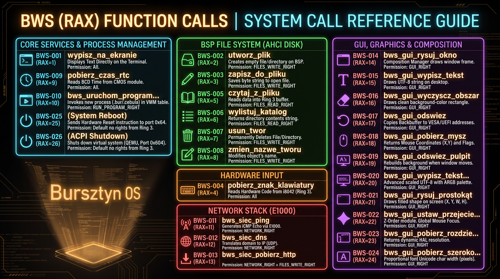

# 06. Bursztynowe Wywołania Systemowe (BWS)

Niniejszy dokument definiuje specyfikację warstwy BWS (Bursztynowe Wywołania Systemowe), która zastępuje klasyczne, anglosaskie określenia typu Syscall Interface lub Application Binary Interface (ABI). BWS stanowi jedyny, bezpieczny i kontrolowany most komunikacyjny, przez który programy użytkownika (.bur) działające w Ring 3 mogą żądać od Jądra Bursztyna (Ring 0) wykonania operacji uprzywilejowanych.
6.1 Mechanizm Sprzętowy SYSCALL i Przejście Ring 3 -> Ring 0

W architekturze x86-64 tradycyjne przerwania programowe (np. int 0x80 znane z systemów 32-bitowych) zostały zastąpione dedykowanymi, ultraszybkimi instrukcjami sprzętowymi: SYSCALL (wywołanie) oraz SYSRET / IRETQ (powrót).

## Proces przejścia ze strefy użytkownika do Jądra w Bursztyn OS przebiega następująco:

1. Inicjalizacja rejestrów MSR: Podczas rozruchu Jądro konfiguruje rejestry specyficzne dla modelu (MSR). Do rejestru IA32_LSTAR wpisywany jest adres wskaźnika niskopoziomowej asemblerowej funkcji obsługi (bws_obsluga). Do rejestru IA32_STAR ładowane są selektory segmentów kodu i danych dla Ring 0 oraz Ring 3 (zdefiniowane w GDT).

1. Wywołanie instrukcji: Program użytkownika (np. Terminal lub Notatnik) umieszcza kod identyfikacyjny wywołania (RAX) oraz wymagane parametry w rejestrach procesora, a następnie wykonuje instrukcję SYSCALL.

1. Działanie procesora: Procesor natychmiastowo przełącza segment kodu CS na Ring 0 (Jądro), zapisuje adres powrotny w rejestrze RCX, stan flag w R11 i wykonuje skok pod adres zapisany w IA32_LSTAR. Dodatkowo, sprzętowy segment TSS (Task State Segment) podmienia wskaźnik stosu (RSP) na bezpieczny stos Jądra.

1. Obsługa w Jądrze: Jądro zabezpiecza rejestry aplikacyjne na stosie, przeprowadza rygorystyczną weryfikację uprawnień zaufania (BZL) i wykonuje żądaną operację (np. odczyt z dysku AHCI, renderowanie okna, wysłanie pakietu sieciowego).

# 6.2 Konwencja Bursztyn OS BWS

Bursztyn OS wykorzystuje autorski standard przekazywania parametrów w C/C++ poprzez funkcję mostkującą bws_wywolaj(). W celu zachowania czytelności kodu i optymalizacji bare-metal, wszystkie wywołania są zgrupowane w potężnej instrukcji switch w pliku syscalls.cpp.

* RAX – Numer identyfikacyjny wywołania systemowego (Kod BWS).

* Pozostałe rejestry argumentów (R8-R13) – Zgodnie ze standardem x86_64 ABI, przekazują kolejne parametry wywołania. Rejestry przed wysłaniem są często kompresowane metodą przesunięć bitowych (np. X i Y pakowane w jeden rejestr 64-bitowy (x << 32) | y).

Po zakończeniu operacji, Jądro zwraca wynik (kod błędu, ilość przeczytanych bajtów lub status sukcesu) zawsze w rejestrze RAX. Wartość numeryczna 0 najczęściej oznacza brak dostępu lub błąd wykonania.
## 6.3 Pełny Rejestr Funkcji Jądra (Tabela BWS)

Poniższa tabela stanowi kompletną mapę zaimplementowanych 26 wywołań systemowych w Bursztyn OS (moduły Plikowe, Sieciowe, GUI i Systemowe).

Kod BWS (RAX),Wywoływana funkcja w Jądrze,Zastosowanie / Opis Operacji,Wymagane Uprawnienie BZL / PZB
BWS-001,wypisz_na_ekranie,Wyświetlenie tekstu bezpośrednio na terminalu.,Wszystkie
BWS-002,utworz_plik,"Tworzy nowy, pusty plik / teczkę w BSP (Dysk AHCI).",PRAWO_PLIKI_ZAPISZ
BWS-003,zapisz_do_pliku,Zapisuje ciąg bajtów do otwartego pliku BSP.,PRAWO_PLIKI_ZAPISZ
BWS-004,pobierz_znak_klawiatury,Odczyt kodu sprzętowego kontrolera i8042 (Ring 3).,Wszystkie
BWS-005,czytaj_z_pliku,Odczytuje dane z pliku BSP do bufora w Ring 3.,PRAWO_PLIKI_CZYTAJ
BWS-006,wylistuj_katalog,Zwraca ciąg tekstowy reprezentujący zawartość teczki.,PRAWO_PLIKI_CZYTAJ
BWS-007,usun_twor,Trwałe wykasowanie obiektu (pliku/teczki) z dysku.,PRAWO_PLIKI_ZAPISZ
BWS-008,zmien_nazwe_tworu,Modyfikuje nazwę węzła indeksowego w strukturach BSP.,PRAWO_PLIKI_ZAPISZ
BWS-009,pobierz_czas_rtc,Odczyt godziny BCD ze sprzętowego modułu CMOS.,Wszystkie
BWS-010,bws_uruchom_program...,Powołuje nowy proces (.bur / .cebula) w nowej tablicy VMM.,PRAWO_URUCHOM_PROGRAM
BWS-011,bws_siec_ping,Generuje ramkę ICMP Echo i wysyła przez kartę E1000.,PRAWO_SIEC
BWS-012,bws_siec_dns,Tłumaczy domenę tekstową na tablicę 4 oktetów IP (UDP).,PRAWO_SIEC
BWS-013,bws_siec_pobierz_http,"Nawiązuje sesję TCP, pobiera zawartość HTTP i utrwala na AHCI.",PRAWO_SIEC + PRAWO_PLIKI_ZAPISZ
BWS-014,bws_gui_rysuj_okno,Prosi Menedżera Kompozycji o narysowanie ramki nowego okna.,PRAWO_GUI
BWS-015,bws_gui_wypisz_tekst,Rysuje stałokolorowy ciąg UTF-8 na pulpicie.,PRAWO_GUI
BWS-016,bws_gui_wyczyscz_obszar,Rysuje czysty prostokąt w kolorze tła.,PRAWO_GUI
BWS-017,bws_gui_odswiez,Kopiuje Liniowy Backbuffer na adresy karty VESA/UEFI.,PRAWO_GUI
BWS-018,bws_gui_pobierz_mysz,"Zwraca współrzędne (X,Y) i flagi przycisków myszy PS/2.",PRAWO_GUI
BWS-019,bws_gui_odswiez_pulpit,Odbudowuje tło i tapetę w przypadku ruchu oknem.,PRAWO_GUI
BWS-020,bws_gui_wypisz_tekst...,Zaawansowane renderowanie UTF-8 ze skalowaniem i paletą ARGB.,PRAWO_GUI
BWS-021,bws_gui_rysuj_prostokat,"Rysuje wypełnioną figurę na ekranie (X, Y, W, H).",PRAWO_GUI
BWS-022,bws_gui_ustaw_przejecie..,Moduł Z-Order. Przypisuje globalnego Focusa Myszki do okna aplikacji.,PRAWO_GUI
BWS-023,bws_gui_pobierz_rozdzie..,Zwraca dynamiczną rozdzielczość na podstawie wybranego trybu HAL.,PRAWO_GUI
BWS-024,bws_gui_pobierz_szeroko..,Zwraca szerokość znaku Unicode (w pikselach) dla proporcjonalnej czcionki.,PRAWO_GUI
BWS-025,(Reboot Systemu),Wysyła instrukcję sprzętową Reset do kontrolera portu 0x64.,Domyślnie brak praw z Ring 3
BWS-026,(ACPI Shutdown),Zamyka system wirtualny (QEMU) wysyłając sygnał ACPI na port 0x604.,Domyślnie brak praw z Ring 3

## Graficzne przedstawienie BWS



# 6.4 Kontrola Uprawnień BZL / PZB w Obsłudze BWS

Jądro Bursztyna kategorycznie odrzuca zasadę ślepego ufania aplikacjom przestrzeni użytkownika. Każde wywołanie trafiające do struktury asynchronicznej Jądra jest poddawane rygorystycznej, dwufazowej weryfikacji w oparciu o manifest procesu (opis.aplikacji zawarty w paczce .cebula):

1. Weryfikacja Flag Uprawnień (Maski Bitowe):
    Przed wykonaniem wrażliwego kodu specyficznego (np. odczyt dysku, transmisja TCP, renderowanie grafiki), Jądro weryfikuje flagi BZL nadane programowi przez kompilator.

```
// Przykład mechanizmu izolacji dla BWS-013 (Pobieranie pliku z sieci HTTP)
if (!(aktywny_proces.uprawnienia & PRAWO_PLIKI_ZAPISZ)) {
    return 0; // Odmowa - brak uprawnień dyskowych
}
```
2. Weryfikacja Poziomu Zaufania (Ochrona Ścieżek BZL):
Jądro chroni rdzenne elementy systemu. Nawet jeśli program ma flagę zapisu (np. Notatnik), nie może modyfikować plików krytycznych Jądra.
```
// Blokada modyfikacji katalogów systemowych dla aplikacji użytkownika w Ring 3 (BZL_UZYTKOWNIK)
const char* sciezka = (const char*)arg1;
if (aktywny_proces.poziom_zaufania >= PZB_UZYTKOWNIK && 
   (sciezka_zaczyna_sie_od(sciezka, "/system") || sciezka_zaczyna_sie_od(sciezka, "/jadro"))) {
    return 0; // Odmowa: Integralność systemu chroniona!
}
```
Dzięki tak zbudowanej architekturze, BWS gwarantuje absolutną szczelność systemu operacyjnego. Żadna aplikacja w Ring 3 nie ma prawa wysłać nieautoryzowanych pakietów sieciowych, mazać bezpośrednio po pamięci wideo HAL ani usunąć Jądra, ponieważ napotka nieprzebijalny pancerz logiczny podczas obsługi SYSCALL w pliku syscalls.cpp.
