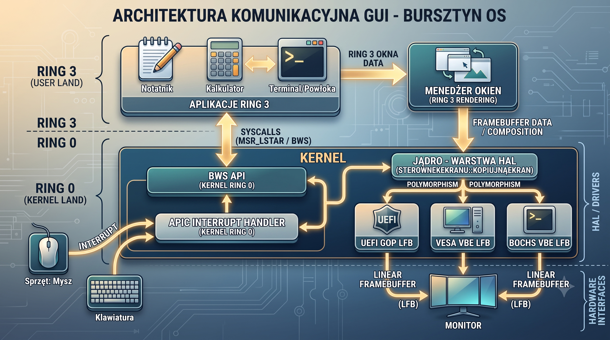

# Wieloplatformowy Tryb Graficzny, Warstwa HAL i Architektura Ring 3

Niniejszy dokument stanowi oficjalne podsumowanie i potężny kamień milowy w rozwoju Bursztyn OS. System operacyjny ostatecznie porzucił sztywne, ograniczone sterowniki i wkroczył w erę w pełni obiektowego, sprzętowo niezależnego interfejsu graficznego (GUI). Dzięki zintegrowaniu z zaawansowanym zarządzaniem pamięcią, Bursztyn OS jest teraz pełnoprawnym, nowoczesnym systemem okienkowym.

## 1. Zrealizowane Cele Technologiczne

Podczas tego etapu udało się z powodzeniem wdrożyć i ustabilizować następujące kluczowe technologie:

### 1.1 Zorientowana Obiektowo Warstwa Abstrakcji Sprzętu (HAL)

System nie polega już wyłącznie na jednym przestarzałym standardzie. Zaimplementowano wirtualną klasę bazową `SterownikEkranu`, po której dziedziczą konkretne sterowniki. Jądro dynamicznie analizuje środowisko rozruchowe za pomocą tagów Multiboot2 i wybiera jeden z trzech dostępnych trybów:

* **Sterownik UEFI GOP:** Nowoczesny, natywny protokół graficzny aktywowany przy uruchamianiu systemu na najnowszych płytach głównych i firmware EFI.
* **Sterownik VESA VBE:** Uniwersalny standard (Legacy BIOS), idealny dla starszych fizycznych komputerów oraz tradycyjnych maszyn wirtualnych.
* **Bochs VBE (Fallback):** Bezpośrednia komunikacja z portami I/O (0x01CE) jako wsparcie dla starszych i specyficznych emulatorów.

Aby to osiągnąć w środowisku Bare-Metal bez biblioteki standardowej C++ (`libstdc++`), zaimplementowano technikę **Placement New**, co zapobiega błędom wskaźników wirtualnych (vtable) i chroni system przed awariami (BSOD).

### 1.2 Optymalizacja VMM (Wielkie Strony 2 MB) i Ochrona Pamięci

Rozwiązano słynny "Problem Kury i Jajka" oraz drastycznie przyspieszono start systemu:

* **Huge Pages (PS):** Menedżer Pamięci Wirtualnej mapuje przestrzeń RAM za pomocą bloków o rozmiarze 2 MB zamiast klasycznych 4 KB. Skraca to czas budowy tablic z kilkunastu sekund do ułamka milisekundy.
* **Bezpieczny Backbuffer:** Bufor ekranu (LFB), tapety oraz ramdysku zostały przeniesione w bezpieczne rejony przestrzeni wirtualnej (powyżej granicy 4 GB). Eliminuje to całkowicie konflikty pamięciowe ze starymi systemami BIOS.

### 1.3 Menedżer Okien (Pulpit) jako Aplikacja Ring 3

Wszystkie plany dotyczące GUI zostały w pełni zrealizowane. Menedżer Okien przestał być zaszyty w Jądrze i stał się pełnoprawnym programem przestrzeni użytkownika (`menedzer_okien.bur`):

* Posiada interaktywny **Pasek Zadań** i **Menu Start**.
* Wspiera renderowanie ikon na pulpicie.
* Obsługuje pełny system **Z-Order** (Aktywny Focus), przyciski akcji na belce tytułowej (Zwiń, Maksymalizuj, Zamknij [X]) oraz płynne przeciąganie okien bez migotania (dzięki Double Bufferingowi).

### 1.4 Aplikacje Użytkowe Ring 3 (Z systemem PZB)

Zbudowano bogate API biblioteki `bursztyn_gui.h`, pozwalające zewnętrznym aplikacjom na proste rysowanie własnych okien, odczyt myszy i wypisywanie polskiego tekstu. Wdrożono pakiety aplikacji `.cebula`:

* **Notatnik:** Graficzny edytor z obsługą odczytu/zapisu plików, wielolinijkowym wprowadzaniem tekstu i przewijaniem.
* **Kalkulator:** W pełni funkcjonalny, okienkowy kalkulator z maszyną stanów.
* **Terminal (bsh):** Potężna, ponad 300-linijkowa powłoka zintegrowana w okno Menedżera, posiadająca zintegrowanego klienta sieci (PING, HTTP, DHCP) i menedżer plików.

## 2. Architektura Komunikacyjna GUI

Przepływ danych i kontroli w nowym, hybrydowym trybie graficznym Bursztyn OS prezentuje się następująco:

